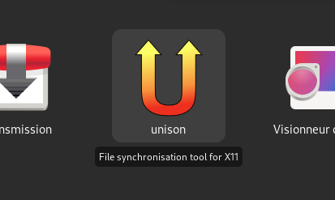

# applications-overview-tooltip
Gnome shell extension that shows a tooltip under applications icons on applications overview and search results.

## Features
- Shows full text instead of cut-off/elipsized application title
- Shows the application description in the tooltip-label (optional) from the .desktop file of the application
- Comes in Czech, Brazilian Portuguese, English, French and German

## One-click install
It's on extensions.gnome.org :
https://extensions.gnome.org/extension/1071/applications-overview-tooltip/

## Manual install
To install, simply download as zip and unzip contents in ~/.local/share/gnome-shell/extensions/applications-overview-tooltip@RaphaelRochet

## Changes

### v14
- Minor refactoring

### v13
- Gnome 41

### v12
- Gnome 40
- Removed ellipsis condition

### v11
- German translation improvements (thanks Etamuk)
- Brings back tooltips on search results
- Fixed schema filename (for packagers)

### v10
- Gnome 3.38

### v9
- Ensure tooltip hiding on page change or overview hiding
- Make title optional in tooltip ; reworked prefs window
- Added Czech translation (thanks Karel Mácha)
- Fixed warnings in log

### v8
- Fixed no tooltip in "Favorites" or after suspend

### v7
- Gnome 3.36
- Updated translations

### v6
- Gnome 3.34

### v5
- Remove swipe animation
- Fix tooltip not showing up sometimes
- Minor fixes

### v4
- Added german language (thanks Nikolai Neff)
- 'No tooltip in groups' bug fix

### v3
- New option to draw borders
- Minor fixes

### v2
- Added translation support
- French language
- A few bug fixed
- New tooltip style
- Added slide animation between icons
- Added group applications count (optional)

## Credits
- 2012,2013 Original author Franco Bianconi
- 2014 Updated and upgraded by Karel Macha

